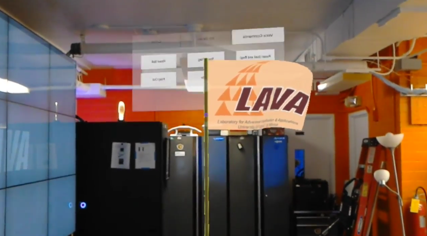

HoloPutt uses a real putter to hit a virtual golf ball into a virtual golf hole. 
An Android phone is used to track and send the real putter's motion information the Hololens.

Final project for UHM ICS 691 (Special Topic Course on Virtual & Augmented Reality).
 
Source: <a href="https://youtu.be/tc19TZhX2MM"><i class="large youtube icon"></i>HoloPutt Demo</a>
